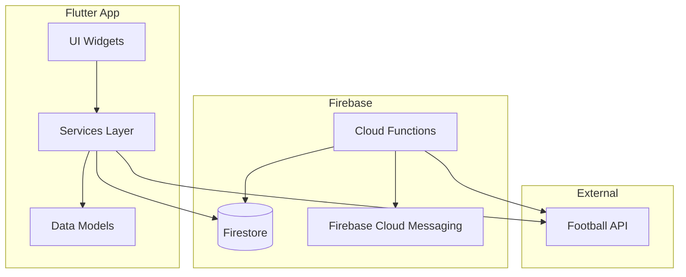
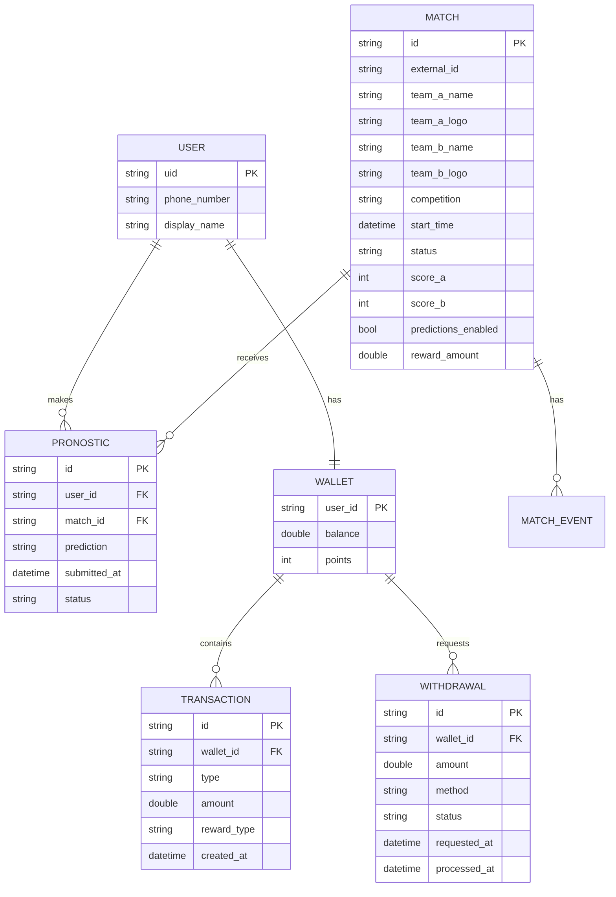

# Design Document: Live Match & Pronostics

## Overview

Le module Live Match & Pronostics ajoute une fonctionnalité interactive à ChooseMe permettant aux utilisateurs de suivre des matchs en direct et de faire des pronostics pour gagner des récompenses. Ce module s'intègre à l'architecture Flutter/Firebase existante et utilise une API externe pour les données de matchs.

### Principes de Design

- **Jeu promotionnel**: Pas de mise d'argent, récompenses offertes par la plateforme
- **Temps réel**: Scores mis à jour toutes les 30-60 secondes
- **Équité**: Horodatage serveur pour tous les pronostics
- **Sécurité**: Anti-fraude et rate limiting

## Architecture



### Architecture des Données



## Components and Interfaces

### 1. Data Models (Firestore Records)

#### MatchRecord
```dart
class MatchRecord extends FirestoreRecord {
  String externalId;        // ID from Football API
  String teamAName;
  String teamALogo;
  String teamBName;
  String teamBLogo;
  String competition;
  DateTime startTime;
  String status;            // 'scheduled', 'live', 'finished', 'postponed'
  int scoreA;
  int scoreB;
  int matchMinute;
  bool predictionsEnabled;
  double rewardAmount;
  DateTime createdAt;
  DateTime updatedAt;
}
```

#### PronosticRecord
```dart
class PronosticRecord extends FirestoreRecord {
  DocumentReference userRef;
  DocumentReference matchRef;
  String prediction;        // 'team_a', 'draw', 'team_b'
  DateTime submittedAt;     // Server timestamp
  String status;            // 'pending', 'won', 'lost'
  String userName;          // Denormalized for leaderboard
}
```

#### WalletRecord
```dart
class WalletRecord extends FirestoreRecord {
  DocumentReference userRef;
  double balance;
  int points;
  DateTime createdAt;
  DateTime updatedAt;
}
```

#### TransactionRecord
```dart
class TransactionRecord extends FirestoreRecord {
  DocumentReference walletRef;
  String type;              // 'credit', 'debit'
  double amount;
  String rewardType;        // 'money', 'points', 'subscription', 'gift'
  String description;
  DocumentReference? matchRef;
  DateTime createdAt;
}
```

#### WithdrawalRecord
```dart
class WithdrawalRecord extends FirestoreRecord {
  DocumentReference walletRef;
  DocumentReference userRef;
  double amount;
  String method;            // 'mobile_money'
  String phoneNumber;
  String status;            // 'pending', 'approved', 'rejected'
  String? rejectionReason;
  DateTime requestedAt;
  DateTime? processedAt;
}
```

### 2. Services

#### FootballApiService
```dart
class FootballApiService {
  // Fetches today's matches from external API
  Future<List<MatchData>> getTodayMatches();
  
  // Fetches live scores for active matches
  Future<List<MatchScore>> getLiveScores(List<String> matchIds);
  
  // Fetches match details
  Future<MatchData> getMatchDetails(String matchId);
}
```

#### PronosticService
```dart
class PronosticService {
  // Validates and submits a prediction
  Future<Result<PronosticRecord>> submitPrediction({
    required String matchId,
    required String prediction,
  });
  
  // Gets user's prediction for a match
  Future<PronosticRecord?> getUserPrediction(String matchId);
  
  // Gets all predictions for a match (admin)
  Stream<List<PronosticRecord>> getMatchPredictions(String matchId);
  
  // Gets user's prediction history
  Stream<List<PronosticRecord>> getUserPredictions();
}
```

#### WalletService
```dart
class WalletService {
  // Gets or creates user wallet
  Future<WalletRecord> getOrCreateWallet();
  
  // Credits reward to wallet
  Future<void> creditReward({
    required double amount,
    required String rewardType,
    required String matchId,
  });
  
  // Requests withdrawal
  Future<Result<WithdrawalRecord>> requestWithdrawal({
    required double amount,
    required String phoneNumber,
  });
  
  // Gets transaction history
  Stream<List<TransactionRecord>> getTransactionHistory();
  
  // Gets withdrawal history
  Stream<List<WithdrawalRecord>> getWithdrawalHistory();
}
```

#### LeaderboardService
```dart
class LeaderboardService {
  // Gets winners for a match
  Stream<List<PronosticRecord>> getMatchWinners(String matchId);
  
  // Gets global leaderboard (top winners)
  Stream<List<LeaderboardEntry>> getGlobalLeaderboard();
}
```

### 3. UI Components

#### Pages
- `MatchesListWidget` - Liste des matchs du jour avec badge LIVE
- `MatchDetailWidget` - Détail d'un match avec formulaire de pronostic
- `PronosticsHistoryWidget` - Historique des pronostics de l'utilisateur
- `WalletWidget` - Portefeuille avec solde et historique
- `LeaderboardWidget` - Classement des gagnants
- `WithdrawalWidget` - Formulaire de demande de retrait

#### Admin Pages (dans le dashboard existant)
- Section "Matchs" - Gestion des matchs
- Section "Pronostics" - Statistiques des pronostics
- Section "Retraits" - Validation des retraits

### 4. Cloud Functions

```javascript
// Sync matches from external API (scheduled every 5 minutes)
exports.syncMatches = functions.pubsub.schedule('every 5 minutes')
  .onRun(async (context) => { ... });

// Process match results when status changes to 'finished'
exports.processMatchResults = functions.firestore
  .document('matches/{matchId}')
  .onUpdate(async (change, context) => { ... });

// Send notifications for prediction results
exports.sendPredictionNotification = functions.firestore
  .document('pronostics/{pronosticId}')
  .onUpdate(async (change, context) => { ... });
```

## Data Models

### Firestore Collections Structure

```
/matches/{matchId}
  - externalId: string
  - teamAName: string
  - teamALogo: string
  - teamBName: string
  - teamBLogo: string
  - competition: string
  - startTime: timestamp
  - status: string
  - scoreA: number
  - scoreB: number
  - matchMinute: number
  - predictionsEnabled: boolean
  - rewardAmount: number
  - createdAt: timestamp
  - updatedAt: timestamp

/pronostics/{pronosticId}
  - userRef: reference
  - matchRef: reference
  - prediction: string ('team_a' | 'draw' | 'team_b')
  - submittedAt: timestamp (server)
  - status: string ('pending' | 'won' | 'lost')
  - userName: string

/wallets/{userId}
  - userRef: reference
  - balance: number
  - points: number
  - createdAt: timestamp
  - updatedAt: timestamp

/wallets/{userId}/transactions/{transactionId}
  - type: string ('credit' | 'debit')
  - amount: number
  - rewardType: string
  - description: string
  - matchRef: reference (optional)
  - createdAt: timestamp

/withdrawals/{withdrawalId}
  - walletRef: reference
  - userRef: reference
  - amount: number
  - method: string
  - phoneNumber: string
  - status: string ('pending' | 'approved' | 'rejected')
  - rejectionReason: string (optional)
  - requestedAt: timestamp
  - processedAt: timestamp (optional)

/audit_logs/{logId}
  - userRef: reference
  - action: string
  - details: map
  - ipAddress: string
  - createdAt: timestamp
```

## Correctness Properties

*A property is a characteristic or behavior that should hold true across all valid executions of a system—essentially, a formal statement about what the system should do. Properties serve as the bridge between human-readable specifications and machine-verifiable correctness guarantees.*

### Property 1: Match List Rendering
*For any* list of match objects, the rendered match list widget SHALL display team names, competition name, and formatted start time for each match.
**Validates: Requirements 1.1, 1.5**

### Property 2: Match Status Display
*For any* match with status 'live', the UI SHALL display a LIVE badge. *For any* match with status 'scheduled', the prediction status SHALL display "En attente". *For any* match with status 'finished', the prediction status SHALL display either "Gagnant" or "Perdant".
**Validates: Requirements 1.2, 1.3, 3.6**

### Property 3: Prediction Time Validation
*For any* match, if the current server time is before the match start time, prediction submission SHALL succeed. *For any* match, if the current server time is at or after the match start time, prediction submission SHALL fail with an error.
**Validates: Requirements 2.1, 2.2**

### Property 4: Prediction Uniqueness
*For any* user and match combination, only one prediction SHALL exist. Attempting to submit a second prediction for the same match SHALL fail.
**Validates: Requirements 2.3**

### Property 5: Server Timestamp Recording
*For any* submitted prediction, the `submittedAt` field SHALL be a server-generated timestamp, not a client-provided value.
**Validates: Requirements 2.4, 9.2**

### Property 6: Winner Determination
*For any* finished match, the system SHALL:
1. Identify all predictions matching the actual result
2. Sort correct predictions by `submittedAt` ascending
3. Mark the first 10 as 'won', all others as 'lost'
**Validates: Requirements 3.1, 3.2, 3.3**

### Property 7: Prediction Status Updates
*For any* prediction, after match completion:
- If prediction matches result AND is in top 10 by timestamp → status = 'won'
- If prediction does not match result OR is not in top 10 → status = 'lost'
**Validates: Requirements 3.4, 3.5**

### Property 8: Wallet Balance Operations
*For any* wallet:
- Initial balance SHALL be 0
- After crediting amount X, balance SHALL increase by X
- Transaction history SHALL contain an entry for each credit operation
**Validates: Requirements 4.1, 4.2, 4.3**

### Property 9: Withdrawal Threshold Validation
*For any* withdrawal request with amount less than minimum threshold (5$), the request SHALL be rejected. *For any* withdrawal request with amount greater than or equal to threshold AND less than or equal to balance, a pending withdrawal record SHALL be created.
**Validates: Requirements 4.4, 4.6**

### Property 10: Reward Type Recording
*For any* credited reward, the transaction record SHALL contain both `rewardType` and `amount` fields with valid values.
**Validates: Requirements 5.2, 5.3**

### Property 11: Rate Limiting
*For any* user, submitting more than N predictions within T seconds SHALL result in rejection of excess submissions.
**Validates: Requirements 9.3**

### Property 12: Audit Logging
*For any* prediction submission or withdrawal request, an audit log entry SHALL be created with user reference, action type, and timestamp.
**Validates: Requirements 9.4**

## Error Handling

### API Errors
- **API Unavailable**: Display cached matches with "Données en cache" warning
- **API Rate Limited**: Implement exponential backoff, use cached data
- **Invalid Response**: Log error, skip invalid matches

### Prediction Errors
- **Match Started**: "Ce match a déjà commencé. Les pronostics sont fermés."
- **Duplicate Prediction**: "Vous avez déjà fait un pronostic pour ce match."
- **Rate Limited**: "Trop de requêtes. Veuillez patienter."

### Wallet Errors
- **Insufficient Balance**: "Solde insuffisant pour ce retrait."
- **Below Threshold**: "Le montant minimum de retrait est de 5$."
- **Invalid Phone**: "Numéro de téléphone invalide."

### Network Errors
- **Offline**: Display cached data, queue actions for retry
- **Timeout**: Retry with exponential backoff

## Testing Strategy

### Unit Tests
- Model serialization/deserialization
- Validation logic (prediction time, withdrawal threshold)
- Winner determination algorithm
- Balance calculations

### Property-Based Tests
Using `dart_quickcheck` or `glados` for property-based testing:

1. **Match rendering properties** - Generate random match data, verify rendering
2. **Prediction validation properties** - Generate timestamps, verify acceptance/rejection
3. **Winner determination properties** - Generate prediction sets, verify correct winners
4. **Wallet operation properties** - Generate transactions, verify balance consistency

### Integration Tests
- Firebase Firestore operations
- Cloud Functions triggers
- API service responses

### Configuration
- Minimum 100 iterations per property test
- Tag format: **Feature: live-match-pronostics, Property {number}: {property_text}**
